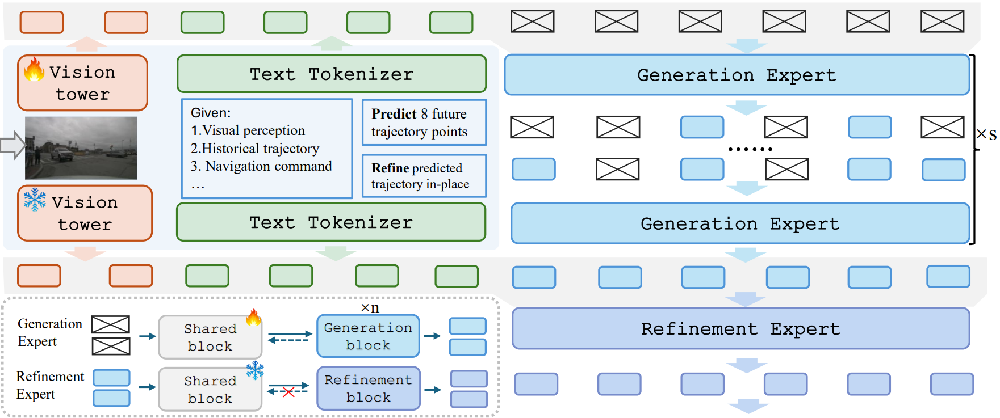

<div align="center">
<h3> DriveFine: Refining-Augmented Masked Diffusion
VLA for Precise and Robust Driving</h3>

<a href="https://arxiv.org/abs/2602.14577"></a>


<div align="center">

[Chenxu Dang](https://msundyy.github.io)<sup>1,2,3\*</sup>, Sining Ang<sup>3</sup>, Yongkang Li<sup>1</sup>, Haochen Tian<sup>2</sup>, Jie Wang<sup>2<sup> Guang Li<sup>2</sup>, Hangjun Ye<sup>2</sup>, 

Jie Ma<sup>1</sup>, Long Chen<sup>2†</sup>, Yan Wang<sup>3†</sup>  


<sup>1</sup>Huazhong University of Science and Technology  
<sup>2</sup>Xiaomi EV   <sup>3</sup>Institute for AI Industry Research (AIR), Tsinghua University

(\*) Work done during the internship at Xiaomi EV and AIR. (†) Corresponding authors.  
<div align="left">

## Abstract

Vision-Language-Action (VLA) models for autonomous driving increasingly adopt generative planners trained with imitation learning followed by reinforcement learning. Diffusion-based planners suffer
from modality alignment difficulties, low training efficiency, and limited generalization. Token-based planners are plagued by cumulative
causal errors and irreversible decoding. In summary, the two dominant
paradigms exhibit complementary strengths and weaknesses. In this paper, we propose DriveFine, a masked diffusion VLA model that combines flexible decoding with self-correction capabilities. In particular, we
design a novel plug-and-play block-MoE, which seamlessly injects a refinement expert on top of the generation expert. By enabling explicit
expert selection during inference and gradient blocking during training,
the two experts are fully decoupled, preserving the foundational capabilities and generic patterns of the pretrained weights, which highlights
the flexibility and extensibility of the block-MoE design. Furthermore,
we design a hybrid reinforcement learning strategy that encourages effective exploration of refinement expert while maintaining training stability. Extensive experiments on NAVSIM v1, v2, and Navhard benchmarks
demonstrate that DriveFine exhibits strong efficacy and robustness.

<div align="left">

## Overview


</div>

<div align="left">

## News

- **`2026/2.17`**: The paper is released on [arXiv](https://arxiv.org/pdf/2602.14577). 


## Acknowledgement

Our code is developed based of following open source codebases:
- [ReCogDrive](https://github.com/xiaomi-research/recogdrive)
- [LaViDa](https://github.com/jacklishufan/LaViDa)

We sincerely appreciate their outstanding works.

## Citation

If you find our work helpful or interesting, don’t forget to give us a ⭐. Thanks for your support!

If this work is helpful for your research, please consider citing:

```
@article{dang2026drivefine,
  title={DriveFine: Refining-Augmented Masked Diffusion VLA for Precise and Robust Driving}, 
  author={Dang, Chenxu and Ang, Sining and Li, Yongkang and Tian, Haochen and Wang, Jie and Li, Guang and Ye, Hangjun and Ma, Jie and Chen, Long and Wang, Yan},
  journal={arXiv preprint arXiv:2602.14577},
  year={2026}
}
```